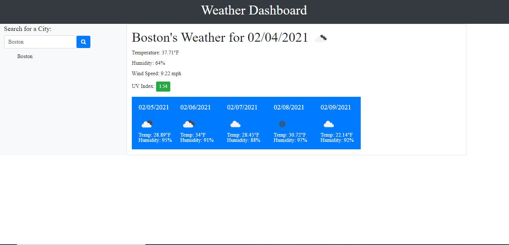

# Weather Dashboard
This app will demonstrate a weather dashboard that runs in the browser featuring dynamically updated HTML, CSS and retrieved data from Open Weather Map API.

## Deployed Link
My deployed link: https://junkoyama.github.io/Weather-Dashboard/

## Final Product
The following screenshot demonstrates the final look of my website (using Boston as a search example):

